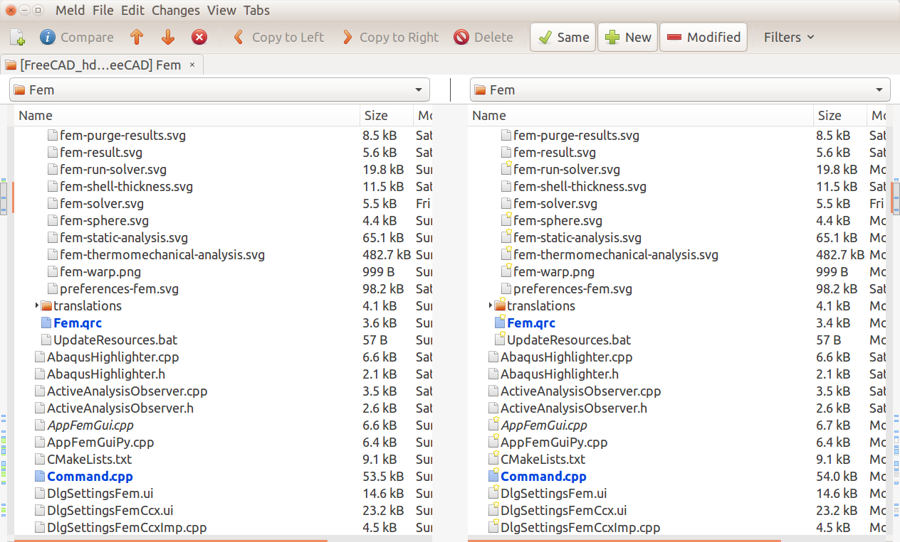

# Contribute code to FreeCAD


## Read first

### The official guide for developer

[Read this first if you want to write code for FreeCAD](http://forum.freecadweb.org/viewtopic.php?f=10&t=12043) 
[Some guide lines for contribute code to FreeCAD]()
Roadmap of FreeCAD: [search FreeCAD and roadmap](https://www.google.co.uk/search?q=FreeCAD+roadmap) to get the last

Those guidelines are a bit terse, it may be worth of demonstration for new developers.

### Read FreeCAD forum and state-of-the-art development

If you want to contribute new feature to FreeCAD, you should know if someone else has already done that or just in the progress of implementing that. 

"Get yourself known to the comminity" by post your ideal onto the forum and hear feedback from community. 


## Develop FreeCAD by git

### Learn git

+ [github cheatsheat](https://training.github.com/kit/downloads/github-git-cheat-sheet.pdf)
This section will explain in details: How you can contribute to FreeCAD project

+ [git from the bottom up](https://jwiegley.github.io/git-from-the-bottom-up/)

+ [ The 11 Rules of GitLab Flow ](https://about.gitlab.com/2016/07/27/the-11-rules-of-gitlab-flow/)
[link to Chinese translation of The 11 Rules of GitLab Flow](http://www.oschina.net/translate/the-11-rules-of-gitlab-flow)

+ github tuotirals for common jobs

+ google if you run into trouble

### GUI tools for git

The Author recommended [gitKraken](https://www.gitkraken.com/), a free, portable and powerful GUI tools. It make the advanced operations like merge, cherry pick easier for new git users.

The best features are:

- one click undo and redo
- visual hint
- intuitive merge for conflict


### Setup your git repo and follow official master

Suggestion by Fem module developer Przome: 

"leave master branch in your github repo the same as the main master branch of FreeCAD main repo. That will make your life much easier when using "git rebase master" to keep you development branch up to date. "

"fork" the official master of FreeCAD in your webbrowser on gitub

clone the forked git into your PC, 
`git clone https://github.com/<yourgithubusername>/FreeCAD.git`
if you have git clone for your fork, you can just add official as remote 
`git remote add upstream git://github.com/FreeCAD/FreeCAD.git`
check you  origin and upstream remote setup
`git remote -v`

Example output from my the author's terminal:
```bash
origin	https://github.com/qingfengxia/FreeCAD.git (fetch)
origin	https://github.com/qingfengxia/FreeCAD.git (push)
upstream	git://github.com/FreeCAD/FreeCAD.git (fetch)
upstream	git://github.com/FreeCAD/FreeCAD.git (push)
```

Also, keep update the local master with upstream, assuming you have not edited the code the master branch
`git pull`

### Implement new functionality in branch

[Git Workflow for Feature Branches](https://gist.github.com/nicholashagen/2855167)

In your module folder commit to local storage and push to your fork online

```
git checkout <testbranch>
git add --all .
git commit --am "module name: your comment on this commit"
git push origin <testbranch>
```
**Particularly, it is a good practice to lead the commit message with the module name**

if you are making change at master branch, do not worry:
`git checkout -b new_branch_name` will move all your change into new branch , then you can 
```
git add --all .
git commit --am "your comment on this commit"
git push origin <testbranch>
```

### Jump between branches

`git checkout some_branch`
if you got error like this:

> error: Your local changes to the following files would be overwritten by >checkout:
> Please, commit your changes or stash them before you can switch branches.
> Aborting

```
git stash
git checkout test_branch
git stash pop
```
Here is a nice little shortcut:

` git checkout --merge some_branch`


### Keep branch updated with official master

`git pull --rebase upstream master`

[Merging an upstream repository into your fork](https://help.github.com/articles/merging-an-upstream-repository-into-your-fork/)

After working on your local fork for a while, probably, there is confilct merge the master.  It is quite challenging for new developer like me. What I did is backup my files working on, which is conflicting with remote master, then merge with remote, finally copy my file back and manually merge the changes. As for module developing, changes are limited into single module, it is not a professional way, but simple way. 

"Rebase is your friend, merge commits are your enemy. "
More here: <http://www.alexefish.com/post/52e5652520a0460016000002>


Start by making changes to the feature branch you're doing work on. Let's assume that these changes span a few commits and I want to consolidate them into one commit. The first step involves making sure the master branch is up to date with the destination repo's master branch:

+ switch to master branch: `git checkout master`
+ ensure our master is up to date: `git pull upstream master`
+ With the master branch up to date, we'll use git rebase to consolidate:
`git checkout your_branch`
`git rebase -i master`
That command will show a list of each commit. If there is conflict, trouble is coming. By default, it’s a classic rebase: cherry-picking in sequence for every commit in the list.  Abort anytime if you are not sure, using `git rebase --abort`.

Uisng merge GUI tool for 2-way merge `git mergetool --tool=meld` each time when there is a conflict. After solving the conflict , `git rebase --continue` again. 

```
git checkout A
git rebase   B    # rebase A on top of B
local is B,
remote is A
```

Instead of interacive mode, `git rebase master` will give you a list of conflicts. Graphical merge GUI tool can be used and `git rebase --continue` 

### Merge with GUI mergetool *meld*

If you start three-pane merging tool (e.g. meld, kdiff3 and most of the others), you usually see **LOCAL on the left (official remote master), merged file in the middle and REMOTE (your dev branch) on the right pane**. It is enough for everyday usage. Edit only the merged file in the middle, otherwise, modification on the left and right will lead to trouble/repeating manually merge conflict many times.

What you don’t see is teh BASE file (the common ancestor of $LOCAL and $REMOTE), how it looked like before it was changed in any way.

*advanced  topic*

Meld has a hidden 3-way merge feature activated by passing in the 4th parameter:

`meld $LOCAL $BASE $REMOTE $MERGED`
The right and left panes are opened in read-only mode, so you can't accidentally merge the wrong way around. The middle pane shows the result of merge.For the conflicts it shows the base version so that you can see all the important bits: original text in the middle, and conflicting modifications at both sides. Finally, when you press the "Save" button, the $MERGED file is written - exactly as expected by git.
The ~/.gitconfig file I use contains the following settings:

```
[merge]
tool = mymeld
conflictstyle = diff3
[mergetool "mymeld"]
cmd = meld --diff $BASE $LOCAL --diff $BASE $REMOTE --diff $LOCAL $BASE $REMOTE --output $MERGED
```
this opens meld with 3 tabs, 1st and 2nd tab containing the simple diffs I'm trying to merge, and the 3rd tab, open by default, shows the 3-way merge view.

1) $LOCAL=the file on the branch where you are merging; untouched by the merge process when shown to you

2) $REMOTE=the file on the branch from where you are merging; untouched by the merge process when shown to you

3) $BASE=the common ancestor of $LOCAL and $REMOTE, ie. the point where the two branches started diverting the considered file; untouched by the merge process when shown to you

4) $MERGED=the partially merged file, with conflicts; this is the only file touched by the merge process and, actually, never shown to you in meld


The middle pane show (BASE) initially and it turns/saved into (MERGED) as the result of  merging. Make sure you move your feature code (LOCAL) from left to the middle  and move upstream updated code from the right pane (REMOTE)

<http://stackoverflow.com/questions/11133290/git-merging-using-meld>

<http://lukas.zapletalovi.com/2012/09/three-way-git-merging-with-meld.html>


### clean branch after failing to rebase

After ignore the official master for half year,  I found it is not possible to rebase my feature. It is ended up with kind of merge, instead of smooth playing back my feature commit.

I start to split my feature into C++ section, which is more stable, into a clean branch for pull request. Instead of manually copying files around, a GUI tool can help to compare and copy files from my feature branch into a clean branch(branch from lastest upstream master), it can compare two folders, more features at
: <http://meldmerge.org/features.html>

`meld  /opt/FreeCAD_hd/src/Mod/Fem/  /opt/FreeCAD/src/Mod/Fem`

File with difference will be highlight, double-click will bring up a double-pane comparasion tab, similar merging operaiton is avaible as in git rebase. 


### git setup for FreeCAD

- line encoding 

For upstream master, line endings is `\r\n`.

```bash
git config --global core.autocrlf input
# Configure Git on OS X or Linux to properly handle line endings

git config --global core.autocrlf true
# Configure Git on Windows to properly handle line endings
``` 

- indentation by spaces

- removing Trailing space, especially for python source code

- backup files

After rebase, lots of `*.orig` files left in source folder. The git mergetool that produces these files, you can disable them with this command:

`git config --global mergetool.keepBackup false`


### useful tips for git users

+ Show history in graph or GUI

Gitg is a clone of Gitk and GitX for GNOME (it also works on KDE etc.) which shows a pretty colored graph. For textual output you can try:
`git log --graph --abbrev-commit --decorate --date=relative --all`
OR 
`git log --graph --oneline --decorate --date=relative --all`
or <https://git.wiki.kernel.org/index.php/Aliases#Use_graphviz_for_display> is a graphviz alias for drawing the DAG graph.I personally use `gitx, gitk --all` and github.


+ List only changes in one Mod folder
```bash
git difftool [<options>] [<commit> [<commit>]] [--] [<path>]
-g/--gui
-d / --dir-diff
git diff master..yourbranch path/to/folder
git diff tag1 tag2 -- some/file/name
```
Copy the modified files to a temporary location and perform a directory diff on them. This mode never prompts before launching the diff tool.

like `mergetool`  GUI tool could be used to assist review diff


+ Clone only one branch from other for testing

`git clone -b foamsolver --single-branch https://github.com/qingfengxia/FreeCAD.git`

+ Undo your mis-conduct in git

[How to undo (almost) anything with Git](https://github.com/blog/2019-how-to-undo-almost-anything-with-git)
```bash
git rm <stagedfile>
git checkout <changed but not staged file>
```
Always do a folder zip backup ,if you are new to git

+ Consolidate/squash several commits into one clean commit before pull request

What I did: merge in my feature branch with the help of GUI 
```
git pull --rebase upstream master
git checkout feature_branc
git rebase -i master
git mergetool -t meld
```
During rebase, there is a chance to squash commits.

### Testing feature or bugfix

After test, git commit it and even git push to your repo. make a copy of the changed folder of the merged-with-upstream feature branch. 

`git checkout master` and copy the folder back. 

`git status` will show all the changed files in feature branch.

`git checkout -b feature_branch_clean` will make a patch/diff of all feature change wihte upstream master. git commit it after testing

`git push origin feature_branch_clean` and make a pull request online

**Testing by macro or scripting**

I taught myself a painful lession by attempting modifying many file before testing. Finally, I start again to refactoring single file and pass the test. 

Unit test would be recommended, feeding predefined data input to automate the testing. 

GUI debugging is time-consuming. FreeCAD has the macro-recording function, which can be used to save time on GUI testing by playing back macro. 

FreeCAD is still under heavy development, testers are welcomed in every modules. 


### Procedure for user without a online forked repo (not tested ,not recommended)

As you don't have push (write) access to an upstream master repository, then you can pull commits from that repository into your own fork.

   - Open Terminal (for Mac and Linux users) or the command prompt (for Windows users).

   - Change the current working directory to your local project.

   - Check out the branch you wish to merge to, usually, you will merge into master

   -  `git checkout master`

   -  Pull the desired branch from the upstream repository. `git pull upstream master`, This method will retain the commit history without modification.

   - `git pull https://github.com/ORIGINAL_OWNER/ORIGINAL_REPOSITORY.git BRANCH_NAME`

   - If there are conflicts, resolve them. For more information, see "Resolving a merge conflict from the command line".

   - Commit the merge.

   -  Review the changes and ensure they are satisfactory.

   - Push the merge to your GitHub repository.

   - git push origin master

### Pull request and check feedback

**It is recommended to submit small, atomic, manageable pull request to master, definitely after a full test.**

After you push your commit to your fork/branch, you can *compare* your code with master. It is worth of coding style checking. For python code, using `flake`, `PEP8` etc. , `cppcheck` for C++ code. 

Follow the standard github pull request routine, plus create a new post to describe the pull request, and wait for core developers/collobrators to merge. 


### example of pull request for bugfix

Spot out the bug: naming bug in Fem module: `StanardHypotheses` should be `StandardHypotheses`


1. find the bug and plan for bugfix

Assuming, current folder is Fem `/opt/FreeCAD/src/Mod/Fem`, find a string in all files in a folder, including subfolders:
`grep -R 'StanardHypotheses' ./`
output:
```
./App/FemMesh.cpp:void FemMesh::setStanardHypotheses()
./App/FemMesh.h:    void setStanardHypotheses();
./App/FemMeshPyImp.cpp:PyObject* FemMeshPy::setStanardHypotheses(PyObject *args)
./App/FemMeshPyImp.cpp:        getFemMeshPtr()->setStanardHypotheses();
./App/FemMeshPy.xml:        <Methode Name="setStanardHypotheses">
```

If not, then use find, try  this: `find ./ -type f -exec grep -H 'yourstring' {} +`

2. make the patch and test locally

pull from the most updated upstream master, then make a new branch and checkout this branch `git checkout renamingFem`

replace a string in all files in a folder, including subfolders
```
grep -rl StanardHypotheses ./ | xargs sed -i 's/StanardHypotheses/StandardHypotheses/g'
```

check the result of replacement: 
There should be no output: `grep -R 'StanardHypotheses' ./`
Then again: `grep -R 'StandardHypotheses' ./`, should match the file and lines number found in step 1
```
git add ./App/FemMesh.cpp
git add ./App/FemMesh.h
git add ./App/FemMeshPyImp.cpp 
git add ./App/FemMeshPy.xml
git commit -m "correct spelling StanardHypotheses to StandardHypotheses"
```

Compile the source, make sure it can compile and function as expected. This function is not used in other module, so there is no need for function test.


3. submit pull request to upstream master

the push target is not official master, but developered github repo, see `git remote -v`
`git push origin renamingFem`

On your project page of the github website, select this fork and *creat pull request* to official master.A good description of bug and bugfix will make this pull request easier to be approciated.

Do it as quick as as possible, or this pull request will not be automatically merge with official master.

=================================================================

## Code review

### develop in developer's fork and test before PR

### Travis-ci auto compiling for pull request

After a pull request on github, it will be compiled and unit test will be conducted automatically at 3 major platforms, win, macos and ubuntu.

`Continuous-integration/appveyor/pr — Waiting for AppVeyor build to complete`

`Required continuous-integration/travis-ci/pr — The Travis CI build is in progress` 

The setup of Travis-ci for github is very straight-forward, see official manual <https://docs.travis-ci.com/user/getting-started/>


    1. Sign in to Travis CI with your GitHub account, accepting the GitHub access permissions confirmation.

    Once you’re signed in, and we’ve synchronized your repositories from GitHub, go to your profile page and enable Travis CI for the repository you want to build.

        Note: You can only enable Travis CI builds for repositories you have admin access to.

    2. Add a .travis.yml file to your repository to tell Travis CI what to build:

    3. Add the .travis.yml file to git, commit and push, to trigger a Travis CI build:

        Travis only runs a build on the commits you push after adding the repository to Travis.

    4. Check the build status page to see if your build passes or fails.


However, for module developers, the free compiling service may not be so usful. The compiling of FreeCAD code base may be too long to finish within free time limit.

### code review tool and process

[code review tool and process](http://forum.freecadweb.org/viewtopic.php?f=10&t=12600&start=10)

Phabricator looks really promising - there are tons of options, so I'll be posting things that might be useful for us.

1. We should use "review" workflow (commit is reviewed before is included in the master branch). More here [1]
2. Phabricator can host git repository, can tract remote repo (that's what is configured right now) and can use mirrors. What we need is not clear for me yet.
3. We'd need at least virtual server to set it up - there are some tweaks in mysql/php required, so a normal cloud hosting might not be enough.
4. The system right now runs on raspberry pi model 2 B (4 core, 1GB, 100Mb ethernet), and is connected over my home broadband (240/20Mb), so any virtual server should be more than enough to run it.
5. Configuration of the system is "I'll guide you by the hand" (Please set variable X = Y in file /etc/myslq/whatever) or GUI driven. It's easy.
6. It's handy to have mail server configured (postfix), for notifications/password reset.
7. Setting up dashboard (page that users see as the main page) - it's gui driven and very easy.
8. There are github integration options - I did not explore them yet.

[1] https://secure.phabricator.com/book/pha ... _vs_audit/
