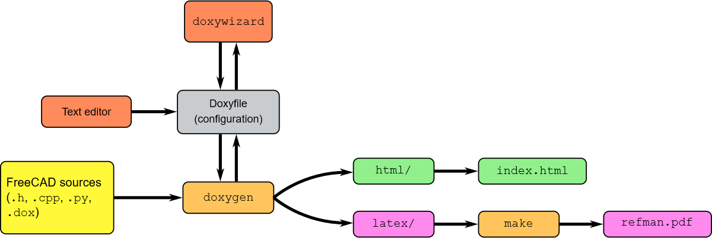

# Organization of FreeCAD Source Code

The FreeCAD official repository has the standard github project layout, with README, License, Continuous Integration setup files at the repository root. The FreeCAD [source tree in the `src/` folder](https://github.com/FreeCAD/FreeCAD/tree/master/src/Ext/freecad) reflects its modular design.

## List of files and folders in FreeCAD source folder
[[This section will be generated by python script]]


## List of modules in FreeCAD Mod folder
[[This section will be generated by python script]]


## Documentation

### Doxygen generated documents

The source documentation is generated by **doxygen** from C++ and python source in-code documentation strings. The  **doxygen** official website of doxygen project has an excellent documentation on writing in-source document and document generation. FreeCAD project has a dedicate Wiki Doxygen page: https://www.freecadweb.org/wiki/Doxygen



The generated doxygen  documentation (static html contents) can be found on the author's personal website [Doxygen generated online documentation of source  for 0.19dev on 2019-06-24](https://www.iesensor.com/FreeCADDoc/0.19/modules.html)

### FreeCAD wiki

In addition to doxygen generated source documentation, FreeCAD wiki are anther source of documentation giving more information on topics like software design, specific module. 

https://www.freecadweb.org/wiki/Main_Page

There are 3 user hubs

> [](https://www.freecadweb.org/wiki/File:Crystal_Clear_app_display.png) [Users hub](https://www.freecadweb.org/wiki/User_hub):  This page contains documentation useful for FreeCAD users in general: a  list of all the workbenches, detailed instructions on how to install  and use the FreeCAD application, tutorials, and all you need to get  started. 
>
> [](https://www.freecadweb.org/wiki/File:Crystal_Clear_app_terminal.png) [Power users hub](https://www.freecadweb.org/wiki/Power_users_hub):  This page gathers documentation for advanced users and people  interested in writing python scripts. You will also find there a  repository of macros, instructions on how to install and use them, and  more information about customizing FreeCAD to your specific needs. 
>
> [](https://www.freecadweb.org/wiki/File:Crystal_Clear_app_tutorials.png) [Developers hub](https://www.freecadweb.org/wiki/Developer_hub):  This section contains material for developers: How to compile FreeCAD  yourself, how the FreeCAD source code is structured and how to navigate  in it, and how to develop new workbenches, or embed FreeCAD in your own  application. 

Among, Developers hub is essential readings for module developers.

 ### User manual 

One of the principal developer,  has wrote a proper user manual for FreeCAD version **0.18**.

> [](https://www.freecadweb.org/wiki/File:Crystal_Clear_manual.png) [The FreeCAD manual](https://www.freecadweb.org/wiki/Manual:Introduction)   is another, more linear way to present the information contained in  this wiki. It is made to be read like a book, and will gently introduce  you to many other pages from the hubs above.  


## Build System for FreeCAD

### Introduction to CMake

[CMake](https://cmake.org/) is the cross-platform build tool for FreeCAD. Along with generating the make files that are used to build FC, it also generates the installer for Windows, the DEB/RPM packages for Linux, and an image bundle MacOS X.

See [Appendix 2 cmake cheatsheet](./A2.cmake_cheatsheet.md) for a quick start on CMake.


### CMake in FreeCAD

The project top level `CMakeLists.txt` at the repository root is very long, detecting third party library detection and dealing compiler and OS differences.  In contrast, [src/CMakeLists.txt] in the source tree is the much shorter, with `add_directory(subfolder_name)`. 

[CMake](https://github.com/FreeCAD/FreeCAD/tree/master/cMake) folder in the repo root is filled with `*.cmake` files to detect libraries. If a new workbench with c++ code is added, then CMake's third parties detection CMake file is probably needed.

```shell
set(CMAKE_MODULE_PATH "${CMAKE_CURRENT_SOURCE_DIR}/cMake")
```

The following hypothetical code demonstrates how we can specify with CMake to not build OpenFOAM from source but instead we can just install as a  binary. The same can be done for other dependencies like other FEM meshing tools like `netgen`, and `gmsh`.  

```shell
if(NOT MSVC)
    OPTION(BUILD_FEM_FOAM "Build the FreeCAD FEM module with the OpenFOAM CFD solver" ON)
else
    OPTION(BUILD_FEM_FOAM "Build the FreeCAD FEM module with the OpenFOAM CFD solver" OFF)
endif(NOT MSVC)
```
Examining further, we can see the following in the the toplevel CMake file [src/CMakeLists.txt]

```shell
# -------------------- OpenFOAM --------------------
    if (BUILD_FEM_FOAM)
        find_package(FOAM)
    endif(BUILD_FEM_FOAM)

```

### Code Analysis for [cMake/SMesh.cMake](https://github.com/FreeCAD/FreeCAD/tree/master/cMake/SMesh.cMake)

```shell
# Try to find Salome SMESH
# Once complete, this will define
#
# SMESH_FOUND         - if the current system has Salome SMESH
# SMESH_INCLUDE_DIR   - path to the Salome SMESH include directory
# SMESH_LIBRARIES     - path to the Salome SMESH libraries
#


IF (CMAKE_COMPILER_IS_GNUCC)
    FIND_PATH(SMESH_INCLUDE_DIR SMESH_Mesh.hxx
    # These are default search paths, why specify them?
    # /usr/include
    # /usr/local/include
    PATH_SUFFIXES smesh
    )
    FIND_LIBRARY(SMESH_LIBRARY SMESH
    #  /usr/lib
    #  /usr/local/lib
    )
ELSE (CMAKE_COMPILER_IS_GNUCC)
    # Not yet implemented
ENDIF (CMAKE_COMPILER_IS_GNUCC)

SET(SMESH_FOUND FALSE)
IF(SMESH_LIBRARY)
  SET(SMESH_FOUND TRUE)
  GET_FILENAME_COMPONENT(SMESH_LIBRARY_DIR ${SMESH_LIBRARY} PATH)
  set(SMESH_LIBRARIES
    ${SMESH_LIBRARY_DIR}/libDriver.so
    ${SMESH_LIBRARY_DIR}/libDriverDAT.so
    ${SMESH_LIBRARY_DIR}/libDriverSTL.so
    ${SMESH_LIBRARY_DIR}/libDriverUNV.so
    ${SMESH_LIBRARY_DIR}/libSMDS.so
    ${SMESH_LIBRARY_DIR}/libSMESH.so
    ${SMESH_LIBRARY_DIR}/libSMESHDS.so
    ${SMESH_LIBRARY_DIR}/libStdMeshers.so
  )
ENDIF(SMESH_LIBRARY)
```

## Continuous Integration (CI)

Continuous Integration (CI) is basically a paradigm for building and testing automation.
CI is crucial to maintain a software project efficiently. There are several CI tools
that are utilized by FreeCAD. 

### Travis CI

Travis is tightly integrated with github and it is widely used in the FreeCAD github repo.
For more information on how to set Travis CI for a code repository read this [useful guide](https://github.com/dwyl/learn-travis).

Travis uses YAML files. For the Linux and MacOS platform, the main Travis config file for FreeCAD is [.travis.yml](https://github.com/FreeCAD/FreeCAD/blob/master/.travis.yml).  Travis CI has experimental support of windows platform, used by FreeCAD 0.19 development.
For Windows, the config file is [.travis/build.bat](https://github.com/FreeCAD/FreeCAD/blob/master/.travis/build.bat). 

To understand the process of building on windows, see wiki page: 

<https://www.freecadweb.org/wiki/Compile_on_Windows>

### Other CI tools: CircleCI and AppVoyer

Along with Travis, there is a whole ecosystem of CI Software, you can learn learn
more about them through a dedicated [Wikipedia page](https://en.wikipedia.org/wiki/Comparison_of_continuous_integration_software)

[.circleci/config.yml](https://github.com/FreeCAD/FreeCAD/tree/master/.circleci/config.yml)
which will pull a docker image to setup testing environment.

FreeCAD project use AppVoyer for building on windows, although it is a cross-platform solution. Sign up and setup github and bitbucket repo is simple, see official document <https://www.appveyor.com/docs/>. 

### arcconfig and phabricator

```javascript
"phabricator.uri" : "http://pha.geofinder.eu/"
```
### vagrant cloud VM

FreeCAD has a subfolder to setup cloud VM for building and testing

### docker configuration
[subuser/freecad-dev](https://github.com/FreeCAD/FreeCAD/blob/master/subuser/freecad-dev)
[.subuser.json] 	adds subuser files for developing freecad within a Docker container.


## Packaging and Deployment

see wiki <https://www.freecadweb.org/wiki/Download> for binary release of FreeCAD

### Linux RPM and Deb, AppImage

FreeCAD has been in official repo of major Linux distro, but the version may be outdated. For Ubuntu, there is PPA to install the latest or even daily development build.  Similarly, there is kind of FreeCAD daily build provided by FreeCAD team for fedora systems. It is recommended for developers to install latest version, especially Qt5+Python3 combination.  see instruction of install the latest FreeCAD on the wiki page <https://www.freecadweb.org/wiki/Install_on_Unix>

### Windows installer

Windows installer is generated by NSIS, and open source windows installer generation tool. Packaging for windows its in another subproject `FreeCADInstProj`, see https://github.com/FreeCAD/FreeCAD/tree/master/src/WindowsInstaller. 

### OSX prebuild

The main Travis config file for FreeCAD is [.travis.yml](https://github.com/FreeCAD/FreeCAD/blob/master/.travis.yml). has the deployment section, to build package for OSX.

### Other cross platform package managers

The package folder in the repository root contains the `[conda]()` recipe to build Anaconda package. `Conda` is a popular binary python package (python module compiled from other languages) distribution system. 

`fedora` subfolder has the configuration 


## Learning path

1. be familiar with FreeCAD Gui Operation as a user

see [FreeCAD wiki user hub](https://www.freecadweb.org/wiki/), tutorials on youtube and [user manual]()

2. be familiar with Python scripting, learning from macro recording.

The amazing feature of FreeCAD is that all GUI operation is recorded in Python console
[FreeCAD wiki power user hub](https://www.freecadweb.org/wiki/Power_users_hub)
[FreeCAD wiki developer hub](https://www.freecadweb.org/wiki/Developer_hub)

3. be familiar with key classes in FreeCAD source code: Base, App, Gui, Part

It is really challenging to code in C++, Python GIL, Coin3D, OCC. However, it is  not needed to know about OCC as module developers.
FreeCAD has a online API document for import classes like Properties, Document Objects, see <https://www.freecadweb.org/wiki/Power_users_hub#API_Functions>

To explore the source code, doxygen generated document is available on `iesensor.com`. Furthermore, `Sourcetrail`can also be one of the tools to help in this effort
is a powerful tool, free for non commercial usage, to explore large softwar projects, see [FreeCAD forum discussion](https://forum.freecadweb.org/viewtopic.php?f=10&t=37386). The software can be downloaded from <https://www.sourcetrail.com/>

4. develop/extend pure Python module, the challenging Python wrapping task can be avoided

5. develop/extend hybrid C++ and Python module

6. write 3D rendering code, i.e. ViewProvider derived classes

************************************************************************
