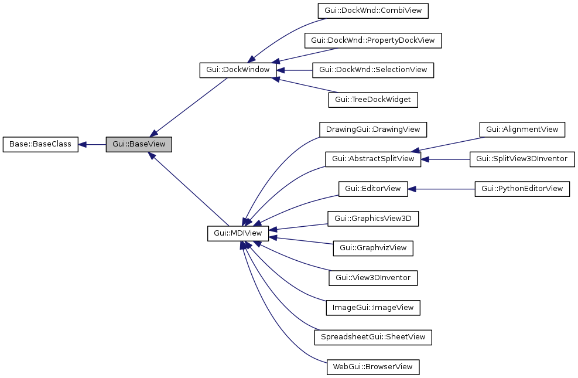
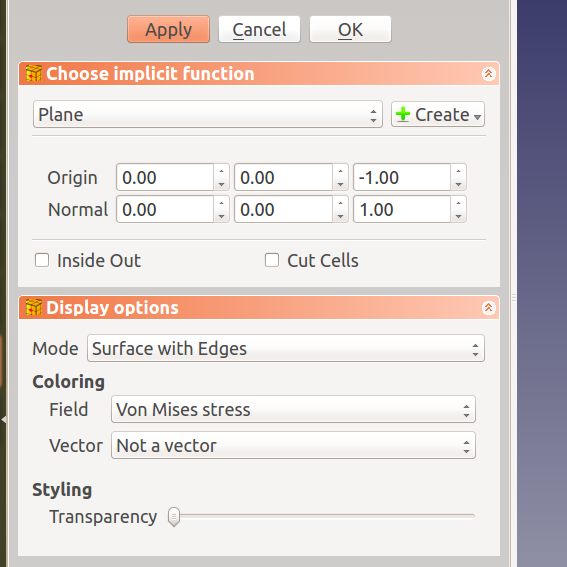

# Overview of Gui module


## List of header files in Gui folder
[[This section will be generated by python script]]

**********************************************************

## Important classes in Gui namespace


### Gui::Application

```cpp
Gui::Application::Instance->activeDocument()
```

### Gui::Document

`Gui::Document()` includes `App::Document` but not inherits from it!
```cpp
class GuiExport Document : public Base::Persistence
{
public:
    Document(App::Document* pcDocument, Application * app);

```

### GUI components




<http://iesensor.com/FreeCADDoc/0.16-dev/df/d3c/classGui_1_1BaseView.html>

PropertyView has PropertyEditor,
```cpp
class PropertyView : public QWidget, public Gui::SelectionObserver
class PropertyDockView : public Gui::DockWindow
```

### Gui Services API

Frequently included headers
```cpp
<Application.h>   //Open and close Document files, control multiple documents
<Selection.h>     //whenever selection in 3D scene is needed
<Command.h>       //scripting, undo support
<CombiView.h>     //object hierarchy true view
<MainWindow.h>    //
<Control.h>       //
```

C++ has different API with python API `FreeCADGui.getCommandManager()`, e.g.
`CommandManager &mgr = Gui::Application::Instance->commandManager();`


### Selection API in Python and C++

The key C++ API are defined in [src/Gui/Selection.h]. see the doxygen document:
<http://free-cad.sourceforge.net/SrcDocu/d4/dca/classGui_1_1SelectionSingleton.html>

The `SelectionSingleton` keeps track of the selection state of the whole application. It gets messages from all entities which can alter the selection (e.g. tree view and 3D-view) and sends messages to entities which need to keep track on the selection state. `SelectionObserver` class implements the observer pattern; `SelectionGate` class enables the selective pickup for the specific type (filtering).

 The selection consists mainly out of following information per selected object:
 - document (pointer)
 - Object (pointer)
 - list of subelements (list of strings)
 - 3D coordinates where the user clicks to select (Vector3d)

Also the preselection is managed. That means you can add a filter to prevent selection  of unwanted objects or subelements.

[src/Gui/Selection.h]

```cpp
std::vector<App::DocumentObject*> getObjectsOfType(const char* typeName, const char* pDocName=0) const;

    struct SelObj {
        const char* DocName;
        const char* FeatName;
        const char* SubName;
        const char* TypeName;
        App::Document* pDoc;
        App::DocumentObject*  pObject;
        float x,y,z;
    };

/** Returns a vector of SelObj struct
* If no document name is given the objects of the active are returned.
* If nothing for this Document is selected an empty vector is returned.
* The vector reflects the sequence of selection.
*/
     std::vector<SelObj> getSelection(const char* pDocName=0) const;

    bool hasSelection() const;
    bool hasSelection(const char* doc) const;

/** Returns a vector of SelectionObjects
* If no document name is given the objects of the active are returned.
* If nothing for this document is selected an empty vector is returned.
* The vector reflects the sequence of selection.
*/
     std::vector<Gui::SelectionObject> getSelectionEx(const char* pDocName=0,Base::Type typeId=App::DocumentObject::getClassTypeId()) const;

```


[python Selection API](https://www.freecadweb.org/wiki/Selection_API>

Python API is a wrapper of methods of `SelectionSingleton` in [src/Gui/Selection.h], i.e. `addSelection(), clearSelection, removeSelection(FreCAD.Object), isSelcted()`
`getSelection()` return a list of `DocumentObject*` for the current document or specified document. Meanwhile, `getSelectionEx()` return a list of `SelectionObject`, which mainly designed for subfeature selection. Notably,`Struct SelObj` has the basic information, but it not exposed to Python.


[src/Gui/SelectionObject.h]
```cpp
class GuiExport SelectionObject : public Base::BaseClass

    /// get the SubElement name of this SelectionObject
    inline const std::vector<std::string> &getSubNames(void) const { return SubNames; }
    /// are there any SubNames selected
    bool hasSubNames(void)const { return SubNames.size() != 0; }
    /// get the name of the Document of this SelctionObject
    inline const char* getDocName(void) const { return DocName.c_str(); }
    /// get the name of the Document Object of this SelectionObject
    inline const char* getFeatName(void) const { return FeatName.c_str(); }
    /// get the Type of the selected Object
    inline const char* getTypeName(void) const { return TypeName.c_str(); }
    /// get the selection points
    inline const std::vector<Base::Vector3d> getPickedPoints(void) const { return SelPoses; }

    /// returns the selected DocumentObject or NULL if the object is already deleted
    const App::DocumentObject *getObject(void) const;
    /// returns the selected DocumentObject or NULL if the object is already deleted
    App::DocumentObject *getObject(void);

    /// check the selected object is a special type or derived of
    bool isObjectTypeOf(const Base::Type& typeId) const;

    /// returns python expreasion sutably for assigning to a LinkSub property
    std::string getAsPropertyLinkSubString(void) const;

```

*************************************************************************

## ViewProvider framework and 3D rederring

See the `ViewProvider` inheritance graph and collaboration diagram,
<http://iesensor.com/FreeCADDoc/0.16-dev/db/d77/classGui_1_1ViewProviderGeometryObject.html>

### `Gui::ViewProvider`

The general interface for all visual stuff in FreeCAD.  This class is used to generate and handle all around visualizing and presenting objects from the FreeCAD App layer to the user. This class and its descendants have to be implemented for any object type in order to  show them in the 3DView and TreeView.

Inventor object will be created and ref in the constructor if defined in this base class; while in destructor, `pyViewObject.unref()` is called, in addition to unref open inventor objects. `show()` and `hide()` are virtual functions, but they have implementation, intensive implementation happens in `Gui::DocumentObjectViewProvider`.
`PyObject* ViewProvider::getPyObject()` has its implementation so all the derived classes for the specific python type, however, only one PyObject destruction happens in this based class (`pyViewObject.unref()` is called).

Base class `ViewProvider`, derived from `PropertyContainer` , is surprisingly short in coding; the derived classes have implementation. Some important methods for python module developer are listed:
- Object     returns the DocumentObject this ViewProvider is associated to
- RootNode      returns the Root coin node of this object
- toString()    returns a string representation of the coin node of this object
- update()    this method is executed whenever any of the properties of this ViewProvider changes

see details python API manual at <https://www.freecadweb.org/api/ViewProvider.html>

[grouped in doxygen document](http://iesensor.com/FreeCADDoc/0.16-dev/d3/db3/classGui_1_1ViewProvider.html)

OpenInventor related objects () are declared as protected var:
```cpp
SoSeparator * 	pcAnnotation // The root separator for annotations.

SoSwitch * 	pcModeSwitch  // this is the mode switch, all the different viewing modes are collected here

SoSeparator * 	pcRoot  // the root Separator of the ViewProvider.

SoTransform * 	pcTransform // 	this is transformation for the provider
```

[src/Gui/ViewProvider.h]
```cpp
void ViewProvider::update(const App::Property* prop)
{
    // Hide the object temporarily to speed up the update
    if (!isUpdatesEnabled())
        return;
    bool vis = ViewProvider::isShow();
    if (vis) ViewProvider::hide();
    updateData(prop);
    if (vis) ViewProvider::show();
}

/// Reimplemented from subclass
void ViewProvider::onChanged(const App::Property* prop)
{
    Application::Instance->signalChangedObject(*this, *prop);
}
```
If Open Inventor objects are defined as property, `attach()` needs to be overridden.


### `Gui::DocumentObjectViewProvider`  

This is the counterpart of the `DocumentObject` in the GUI space. It is only present when FreeCAD runs in GUI mode (e.g. show(), hide(), update() ). It contains all that is needed to represent the `DocumentObject` in the 3D view and the FreeCAD CombiView. It implements `show() hide() attach()`, also restores view provider from document file loaded: `virtual void finishRestoring ()` and `virtual void startRestoring ()`.

This class has detailed [doxygen code documentation in this header file](), Similar with the `ViewProvider` class, `show() hide()` are virtual member functions but with implementation.

[src/Gui/ViewProviderDocumentObject.cpp]
This class defines two new Properties in constructor.
```cpp
    ADD_PROPERTY(DisplayMode,((long)0));
    ADD_PROPERTY(Visibility,(true));
```
 Thereby, `onChanged(const App::Property* prop)` is reimplemented
```cpp
void ViewProviderDocumentObject::onChanged(const App::Property* prop)
{
    if (prop == &DisplayMode) {
        setActiveMode();
    }
    else if (prop == &Visibility) {
        // use this bit to check whether show() or hide() must be called
        if (Visibility.testStatus(App::Property::User2) == false) {
            Visibility.setStatus(App::Property::User2, true);
            Visibility.getValue() ? show() : hide();
            Visibility.setStatus(App::Property::User2, false);
        }
    }

    ViewProvider::onChanged(prop);
}
```

DisplayMode related code is found in`attach()`
```cpp
Gui::MDIView* ViewProviderDocumentObject::getActiveView() const
viewer->getSoRenderManager()->getViewportRegion());
viewer->getSoRenderManager()->getCamera();
```

Similar with ViewProvider class, `show() hide()` are virtual member functions but with implementation.
```cpp
void ViewProviderDocumentObject::updateView()
{
    std::map<std::string, App::Property*> Map;
    pcObject->getPropertyMap(Map);

    // Hide the object temporarily to speed up the update
    bool vis = ViewProvider::isShow();
    if (vis) ViewProvider::hide();
    for (std::map<std::string, App::Property*>::iterator it = Map.begin(); it != Map.end(); ++it) {
        updateData(it->second);
    }
    if (vis) ViewProvider::show();
}
```


### `Gui::ViewProviderGeometryObject`  

The base class for all view providers that display geometric data, like mesh, point clouds, and shapes.
`drag, select(pick), boundingbox, sensorCallback()`

[src/Gui/ViewProviderGeometryObject.cpp]
```cpp
    ADD_PROPERTY(ShapeColor,(r, g, b));
    ADD_PROPERTY(Transparency,(0));
    Transparency.setConstraints(&intPercent);
    App::Material mat(App::Material::DEFAULT);
    ADD_PROPERTY(ShapeMaterial,(mat));
    ADD_PROPERTY(BoundingBox,(false));
    ADD_PROPERTY(Selectable,(true));
```

`void ViewProviderGeometryObject::onChanged(const App::Property* prop)` just call parent methods, in addition to properties defined in this class.
`void ViewProviderGeometryObject::updateData(const App::Property* prop)`, update Placement and PropertyComplexGeoData.


`Gui::ViewProviderBuilder`: Render complex geometry like points.

### `Fem::ViewProviderFemConstraint`
This class draws some visual objects, arrows and cubes in 3D view, see [src/Mod/Fem/Gui/ViewProviderFemConstraint.cpp]

- Some more inventor objects are created in Constructor:
  ```cpp
  SoPickStyle* ps = new SoPickStyle();
  ps->style = SoPickStyle::UNPICKABLE;
  ```  
- `unsetEdit()` is shared by all derived classes for TaskPanel.  
- `onChange()` for updated drawing for changed ViewProvider properties
  ```
void ViewProviderFemConstraint::onChanged(const App::Property* prop)
{
    if (prop == &Mirror || prop == &DistFactor) {
        updateData(prop);
```

[src/Mod/Fem/Gui/ViewProviderFemConstraintFluidBoundary.cpp]

Draw 3D objects more specifically for different constraint types

- `bool ViewProviderFemConstraintFluidBoundary::setEdit(int ModNum)` activate the taskpanel dialog
- `void ViewProviderFemConstraintFluidBoundary::updateData(const App::Property* prop)` for DocumentObject property update


### 3D CAD Part rendering
[src/Mod/Part/Gui/ViewProvider.h]

The base class for all CAD features like boolean operation, fillet, etc... implemented by OpenCASCADE.

```cpp
TopoDS_Shape getShape (const SoPickedPoint *) const
Standard_Boolean computeEdges (SoGroup *root, const TopoDS_Shape &myShape)
Standard_Boolean computeFaces (SoGroup *root, const TopoDS_Shape &myShape, double defl)
Standard_Boolean computeVertices (SoGroup *root, const TopoDS_Shape &myShape)
```

[src/Mod/Part/Gui/ViewProviderExt.cpp] has concrete code to render OpenCASCADE CAD object in 3D view

```cpp
// this was 0.16dev
class PartGuiExport ViewProviderPart : public ViewProviderPartExt
{
    SoCoordinate3     * coords;
    SoBrepFaceSet     * faceset;
    SoNormal          * norm;
    SoNormalBinding   * normb;
    SoBrepEdgeSet     * lineset;
    SoBrepPointSet * nodeset;
}
class ViewProviderShapeBuilder : public Gui::ViewProviderBuilder
```

In version 0.19, 
```cpp
class PartGuiExport ViewProviderPartExt : public Gui::ViewProviderGeometryObject
```
Surprisingly,  the filename and class name are not consistent! In version 0.16dev, the cpp file name was ViewProviderPartExt.cpp


[src/Mod/Part/Gui/ViewProviderPython.cpp] it is possible to access ViewProvider property in Python by aggregation:
`typedef Gui::ViewProviderPythonFeatureT<ViewProviderPart> ViewProviderPython;`

[src/Mod/Part/Gui/ViewProviderCylinderParametric.cpp]
`class PartGuiExport ViewProviderCylinderParametric:public ViewProviderPart`

[src/Mod/Part/Gui/DlgPartCylinderImp.cpp] no concrete code

[src/Mod/Part/App/FeaturePartBox.h]

```cpp
/** App::Feature: Base class of all shape feature classes in FreeCAD  */
class PartExport Feature : public App::GeoFeature

class PartExport Primitive : public Part::AttachableObject

class PartExport Box :public Part::Primitive
App::DocumentObjectExecReturn *Box::execute(void)
{
    double L = Length.getValue();
    double W = Width.getValue();
    double H = Height.getValue();

    if (L < Precision::Confusion())
        return new App::DocumentObjectExecReturn("Length of box too small");

    if (W < Precision::Confusion())
        return new App::DocumentObjectExecReturn("Width of box too small");

    if (H < Precision::Confusion())
        return new App::DocumentObjectExecReturn("Height of box too small");

    try {
        // Build a box using the dimension attributes
        BRepPrimAPI_MakeBox mkBox(L, W, H);
        TopoDS_Shape ResultShape = mkBox.Shape();
        this->Shape.setValue(ResultShape);
    }
    catch (Standard_Failure) {
        Handle_Standard_Failure e = Standard_Failure::Caught();
        return new App::DocumentObjectExecReturn(e->GetMessageString());
    }

    return App::DocumentObject::StdReturn;
}
```


### View3DInventor class

This class derived from Qt MdiView
```
class GuiExport View3DInventor : public MDIView, public ParameterGrp::ObserverType
{
    setOverlayWidget(QWidget*);
    ... mouse  and keyboard events
View3DInventorViewer *getViewer(void) const {return _viewer;}

}
//
class View3DInventorPy : public Py::PythonExtension<View3DInventorPy>
class View3DInventorViewerPy : public Py::PythonExtension<View3DInventorViewerPy>
```

Note: `Quarter::SoQTQuarterAdaptor` is derived from `QGraphicsView`
```
class GuiExport View3DInventorViewer : public Quarter::SoQTQuarterAdaptor, public Gui::SelectionSingleton::ObserverType

```

```
Gui::MDIView* ViewProviderDocumentObject::getInventorView() const
{
    App::Document* pAppDoc = pcObject->getDocument();
    Gui::Document* pGuiDoc = Gui::Application::Instance->getDocument(pAppDoc);

    Gui::MDIView* mdi = pGuiDoc->getEditingViewOfViewProvider(const_cast<ViewProviderDocumentObject*>(this));
    if (!mdi) {
        mdi = pGuiDoc->getViewOfViewProvider(const_cast<ViewProviderDocumentObject*>(this));
    }

    return mdi;
}

Gui::MDIView* ViewProviderDocumentObject::getActiveView() const
{
    App::Document* pAppDoc = pcObject->getDocument();
    Gui::Document* pGuiDoc = Gui::Application::Instance->getDocument(pAppDoc);
    return pGuiDoc->getActiveView();
}
```

### ViewProivder and 3DViewer

The initialization process of the View3DViewer object is highly complex.
[src/Gui/View3DInventorViewer.cpp]
```
init()
{
...
    selectionRoot = new Gui::SoFCUnifiedSelection();
    selectionRoot->applySettings();

    // set the ViewProvider root node
    pcViewProviderRoot = selectionRoot;
...
}

```
 adds an ViewProvider to the view, e.g. from a feature
```cpp
void View3DInventorViewer::addViewProvider(ViewProvider* pcProvider)
{
    SoSeparator* root = pcProvider->getRoot();

    if (root) {
        pcViewProviderRoot->addChild(root);
        _ViewProviderMap[root] = pcProvider;
    }

    SoSeparator* fore = pcProvider->getFrontRoot();

    if (fore)
        foregroundroot->addChild(fore);

    SoSeparator* back = pcProvider->getBackRoot();

    if (back)
        backgroundroot->addChild(back);

    pcProvider->setOverrideMode(this->getOverrideMode());
    _ViewProviderSet.insert(pcProvider);
}
```
setSceneGraph(pcViewProviderRoot);


### 2D drawing rendering using Qt native QGraphicsView

[src/Mod/Drawing/Gui/ViewProviderView.cpp]  Qt2D drawing, not 3D rendering!
[src/Mod/Drawing/Gui/DrawingView.h]
```
class DrawingGuiExport SvgView : public QGraphicsView
class DrawingGuiExport DrawingView : public Gui::MDIView
```

### further reading on ViewProvider

see source code analysis in the later chapters: [src/Mod/Fem/Gui/ViewProviderResult.cpp]

Render 3D object is possbile with pure python, *import pivy*

**************************************************************************************

## selection framework

The SelectionSingleton class keeps track of the selection state of the whole application. For selection in 3D view, selection is based on Inventor classes: "SoPickStyle" "SoPick" and "SoSelection".

It gets messages (Subject and Observer model) from all entities which can alter the selection (e.g. tree view and 3D-view) and sends messages to entities which need to keep track on the selection state.

### [src/Gui/Selection.h]

 This file has defined important classes:  SelectionObserver SelectionChanges  SelectionObserverPython SelectionGate
- SelectionGate: allows or disallows selection of certain types.
- SelectionObserver: observer pattern
- SelectionChanges:  as message for Observer

This file is well documented, see the header file for all API [src/Gui/Selection.h]
```
class GuiExport SelectionSingleton : public Base::Subject<const SelectionChanges&>

bool SelectionSingleton::setPreselect(const char* pDocName, const char* pObjectName, const char* pSubName, float x, float y, float z)

```

### [src/Gui/SelectionObject.h] thin wrapper of DocumentObject pointer

```
class GuiExport SelectionObject : public Base::BaseClass
{

    /// get the name of the Document Object of this SelectionObject
    inline const char* getFeatName(void) const { return FeatName.c_str(); }

    /// returns the selected DocumentObject or NULL if the object is already deleted
    const App::DocumentObject *getObject(void) const;
    ...
```

### [src/Gui/SelectionView.h] show present selection in QListWidget of DockWindow

```
namespace Gui {
namespace DockWnd {

/** A test class. A more elaborate class description.  */
class SelectionView : public Gui::DockWindow,
                      public Gui::SelectionSingleton::ObserverType
{
    Q_OBJECT
    ...
    /// Observer message from the Selection
    virtual void OnChange(Gui::SelectionSingleton::SubjectType &rCaller,
                          Gui::SelectionSingleton::MessageType Reason);


    bool onMsg(const char* pMsg,const char** ppReturn);

    virtual const char *getName(void) const {return "SelectionView";}

    /// get called when the document is changed or updated
    virtual void onUpdate(void);

    QListWidget* selectionView;
```

### [src/Gui/SelectionFilter.h] expression based filtering

 This class builds up a type/count tree out of a string
 to test very fast a selection or object/subelement type   against it.

Example strings are:
"SELECT Part::Feature SUBELEMENT Edge",
"SELECT Robot::RobotObject",
"SELECT Robot::RobotObject COUNT 1..5"

### [src/Gui/MouseSelection.h]


### Example of getSelection
where is this piece of code?

```cpp
    std::vector<Gui::SelectionObject> selection = getSelection().getSelectionEx();

    if (selection.size() != 1) {
        QMessageBox::warning(Gui::getMainWindow(), QObject::tr("Wrong selection"),
            QObject::tr("Select an edge, face or body. Only one body is allowed."));
        return;
    }

    if (!selection[0].isObjectTypeOf(Part::Feature::getClassTypeId())){
        QMessageBox::warning(Gui::getMainWindow(), QObject::tr("Wrong object type"),
            QObject::tr("Fillet works only on parts"));
        return;
    }

```

*******************************************************

## Command framework

Command framework is well-established design pattern, it
C++ code sample is listed here, while python side code is much easier. Example code can be found in Fem module in the later chapters.

*This section is copied from Doxygen generated document* version 0.16dev, accessed: Oct 2015
Doxygen document: Module->Gui->Command Framework

### Overview of command framework

In GUI applications many commands can be invoked via a menu item, a toolbar button or an accelerator key. The answer of Qt to master this challenge is the class QAction. A QAction object can be added to a popup menu or a toolbar and keep the state of the menu item and the toolbar button synchronized.

For example, if the user clicks the menu item of a toggle action then the toolbar button gets also pressed and vice versa. For more details refer to your Qt documentation.

### Drawbacks of QAction

Since QAction inherits QObject and emits the triggered() signal or toggled() signal for toggle actions it is very convenient to connect these signals e.g. with slots of your MainWindow class. But this means that for every action an appropriate slot of MainWindow is necessary and leads to an inflated MainWindow class. Furthermore, it's simply impossible to provide plugins that may also need special slots – without changing the MainWindow class.

### Way out

To solve these problems we have introduced the command framework to decouple QAction and MainWindow. The base classes of the framework are Gui::CommandBase and Gui::Action that represent the link between Qt's QAction world and the FreeCAD's command world.

The Action class holds a pointer to QAction and CommandBase and acts as a mediator and – to save memory – that gets created (Gui::CommandBase::createAction()) not before it is added (Gui::Command::addTo()) to a menu or toolbar.

Now, the implementation of the slots of MainWindow can be done in the method activated() of subclasses of Command instead.

For example, the implementation of the "Open file" command can be done as follows.
```cpp
class OpenCommand : public Command
{
public:
  OpenCommand() : Command("Std_Open")
  {
    // set up menu text, status tip, ...
    sMenuText     = "&Open";
    sToolTipText  = "Open a file";
    sWhatsThis    = "Open a file";
    sStatusTip    = "Open a file";
    sPixmap       = "Open"; // name of a registered pixmap
    sAccel        = "Shift+P"; // or "P" or "P, L" or "Ctrl+X, Ctrl+C" for a sequence
  }
protected:
  void activated(int)
  {
    QString filter ... // make a filter of all supported file formats
    QStringList FileList = QFileDialog::getOpenFileNames( filter,QString::null, getMainWindow() );
    for ( QStringList::Iterator it = FileList.begin(); it != FileList.end(); ++it ) {
      getGuiApplication()->open((*it).latin1());
    }
  }
};
```
An instance of OpenCommand must be created and added to the Gui::CommandManager to make the class known to FreeCAD. To see how menus and toolbars can be built go to the Workbench Framework.


### Boost::signal is used

- Boost signal but it is not maintained, how about migration to boost.signal2

> The Boost.Signals2 (Thread-safe) library is an implementation of a managed signals and slots system. Signals represent callbacks with multiple targets, and are also called publishers or events in similar systems. Signals are connected to some set of slots, which are callback receivers (also called event targets or subscribers), which are called when the signal is "emitted."

**********************************************************************************************

## TaskView Framework: UI for interactive design

Both Qt C++ and python (file names start with *TaskPanel*) are used to design the UI (*.ui file generated by QtDesigner) for FreeCAD.
Related to `setEdit()`, `unsetEdit()` in `ViewProvider` class.
Another Qt library ** is used.
An image shows the taskpanel is welcomed here!

### Important classed related to TaskView

class export to Python: TaskDialog
[src/Gui/TaskView/TaskDialogPython.h]

[src/Gui/TaskView/TaskDialog.h]
```
class TaskDialog{
QObject
...
protected: /// List of TaskBoxes of that dialog
std::vector<QWidget*> Content;

}
```

[src/Gui/TaskView/TaskView.h]
```
class GuiExport TaskGroup : public QSint::ActionBox, public TaskContent
class GuiExport TaskView : public QScrollArea, public Gui::SelectionSingleton::ObserverType
{
//boost::signal connection + slot to App::Document
https://github.com/FreeCAD/FreeCAD/blob/master/src/Gui/TaskView/TaskView.h
// this is an example of QObject event system and boost::signal
}
class GuiExport TaskWatcher : public QObject, public Gui::SelectionFilter
/// List of TaskBoxes of that dialog
std::vector<QWidget*> Content;
```

### Controller of TaskView and TaskDialog

```cpp
//break naming convection
class GuiExport ControlSingleton : public QObject  , control Gui::TaskPanel::ControlDialog

/** The control class
 */
class GuiExport ControlSingleton : public QObject
{
     Q_OBJECT

public:
    static ControlSingleton& instance(void);
    static void destruct (void);

    /** @name dialog handling
     *  These methods are used to control the TaskDialog stuff.
     */
    //@{
    /// This method starts a task dialog in the task view
    void showDialog(Gui::TaskView::TaskDialog *dlg);
    Gui::TaskView::TaskDialog* activeDialog() const;
    //void closeDialog();
    //@}

    /** @name task view handling
     */
    //@{
    Gui::TaskView::TaskView* taskPanel() const;
    /// raising the model view
    void showModelView();
    /// get the tab panel
    QTabWidget* tabPanel() const;  //name should be: getTabPanel()
    //@}

    bool isAllowedAlterDocument(void) const;
    bool isAllowedAlterView(void) const;
    bool isAllowedAlterSelection(void) const;

public Q_SLOTS:
    void accept();
    void reject();
    void closeDialog();
    /// raises the task view panel
    void showTaskView();

private Q_SLOTS:
    /// This get called by the TaskView when the Dialog is finished
    void closedDialog();

private:
    Gui::TaskView::TaskView *getTaskPanel();

private:
    struct status {
        std::bitset<32> StatusBits;
    } CurrentStatus;

    std::stack<status> StatusStack;

    Gui::TaskView::TaskDialog *ActiveDialog;

private:
    /// Construction
    ControlSingleton();
    /// Destruction
    virtual ~ControlSingleton();

    static ControlSingleton* _pcSingleton;
};

/// Get the global instance
inline ControlSingleton& Control(void)
{
    return ControlSingleton::instance();
}
```

[src/Gui/TaskView]

### TaskDriver

In module like Fem, [src/Mod/Fem/Gui/TaskDriver.h]
`class TaskDriver : public Gui::TaskView::TaskBox`



multiple ui files are included into [src/Mod/Fem/Gui/TaskPostBoxes.h]

### preference page

[src/Gui/PropertyPage.h]

`class GuiExport PreferencePage : public QWidget`
`class GuiExport PreferenceUiForm : public PreferencePage`

[src/Mod/Fem/Gui/DlgSettingsFemCcxImp.h]
[src/Mod/Fem/Gui/PrefWidgets.h] wideges with save

```
class DlgSettingsFemCcxImp : public Gui::Dialog::PreferencePage, public Ui_DlgSettingsFemCcxImp
```

## Expression and quantity


**************************************************************************************

## Internationalization with FreeCAD

### Overview of FreeCAD i18n
*This section is mainly copied from FreeCAD documentation*, see [Internationalization with FreeCAD](http://iesensor.com/FreeCADDoc/0.16-dev/de/dea/group__i18n.html)
Doxygen document position: Module->Gui->Internationalization with FreeCAD

The internationalization of FreeCAD makes heavy use of the internationalization support of Qt. For more details refer to your Qt documentation. As FreeCAD will migrated to Qt5 in the future, `QString::fromLatin1()` should be used to convert C-style char array and `std::string` in GUI code.

### integrate a new language into FreeCAD

To integrate a new language into FreeCAD or one of its application modules you have to perform the following steps:

#### Creation of a .ts file

First you have to generate a .ts file for the language to be translated. You can do this by running the lupdate tool in the bin path of your Qt installation. As argument you can specify either all related source files and the .ts output file or a Qt project file (.pro) which contains all relevant source files.

#### Translation into your language

To translate the english string literals into the language you want to support you can open your .ts file with QtLinguist and translate all literals by hand. Another way for translation is to use the tool tsauto from Sebastien Fricker.This tool uses the engine from Google web page (www.google.com).ts auto supports the languages

To get most of the literals translated you should have removed all special characters (like &, !, ?, ...). Otherwise the translation could fail. After having translated all literals you can load the .ts file into QtLinguist and invoke the menu item Release which generates the binary .qm file.

#### Integration of the .qm file

The .qm file should now be integrated into the GUI library (either of FreeCAD itself or its application module). The .qm file will be embedded into the resulting binary file. So, at runtime you don't need any .qm files any more. Indeed you will have a bigger binary file but you haven't any troubles concerning missing .qm files.

To integrate the .qm file into the executable you have to create a resource file (.qrc), first. This is an XML file where you can append the .qm file. For the .qrc file you have to define the following curstom build step inside the Visual Studio project file:

Command Line:
`rcc.exe -name -o "$(InputDir)qrc_$(InputName).cpp" `
Outputs: qrc_.cpp

For the gcc build system you just have to add the line <resourcefile>.qrc to the BUILT_SOURCES sources section of the Makefile.am, run automake and configure (or ./confog.status) afterwards.

#### Q_INIT_RESOURCE
Finally, you have to add a the line
`Q_INIT_RESOURCE(resource);`
where resource is the name of the .qrc file. That's all!

### Update of FreeCAD translation

Online translation project: <https://crowdin.com/project/freecad>
