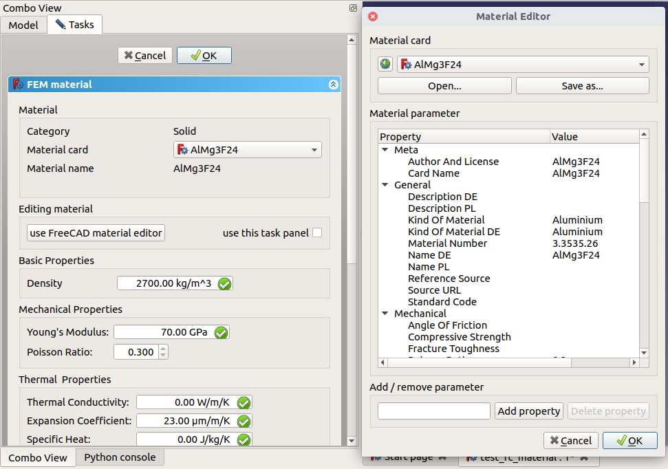

# CAD modules in FreeCAD

## Introduction to FreeCAD's CAD features

Essential modules comparable to commercial tools

+ Part: primitive part making and boolean operations, wrapping around OpenCASCADE API
+ Import: CAD data exchange (step, iges, brep), it does not has a workbench GUI
+ Draft: conventional 2D drawing, such as AutoCAD, DraftSight
+ Sketcher: bottom up geometry building from 2D sketch profile (wire) to 3D part
+ PartDesign: patterns to design complicate part
+ TechDraw: 2D drawing (SVG) generation from 3D part
+ OpenSCAD:  GUI for building geometry using OpenSCAD
+ Measure: measure distance, it does not has a workbench GUI
+ Assembly: not quite mature (not enabled) under development, can try via AddonManager

CAM
+ Path: manufacturing tool path design
+ CAM: not enabled
+ Robotics: robots arm path simulation

CAD and CAE infrastructure
+ Mesh:  surface tessellation, not for 3D volume meshing as used in FEM simulation
+ MeshPart: [ Part](https://www.freecadweb.org/api/d2/db9/namespacePart.html) to [Mesh](https://www.freecadweb.org/api/dc/d48/namespaceMesh.html) (and vice-versa) conversion tools.
+ Point: point cloud
+ Reverse Engineering: reconstruct surface/part from points
+ Surface: for complicate surface creation
+ Material: see details in later section
+ JtReader:  open JT CAD file exchange format, OpenCASCADE has some support on this format.
+ [Raytracing](https://www.freecadweb.org/api/db/dca/group__RAYTRACING.html)

more general infrastructure
+ Plot: pure python implemented module, it is not in offcial mdoules since V0.19
+ Image:
+ spreadsheet: Excel style data table

domain specific CAD
+ Ship: CAD for ship building industry
+ Arch: architecture design
+ Idf:  data exchange format for architecture design

third-party addons and repo
+ see the full list in the `AddonManager` GUI.


see also <https://www.freecadweb.org/api/dd/d0c/group__CWORKBENCHES.html>

## OpenCASCADE and FreeCAD

### OpenCasCade Overview

OpenCASCADE Technoloyg (OCCT) is kind of only full-feature, industrial-strength, open source CAD kernel, on which FreeCAD and Salome are built on. OCCT has been released under LGPL in 2013, not from OCC license any more, see <http://www.opencascade.com/doc/occt-6.9.0/overview/html/technical_overview.html>.

The official (doxygen generated) document is here https://www.opencascade.com/doc/occt-7.3.0/refman/html/index.html

> all OCCT classes organized in hierarchical form corresponding to OCCT  structure (module -> toolkit -> package -> class).


### Relation between OpenCascade(Salome) and FreeCAD

Table: Relation between OpenCascade(Salome) and FreeCAD

| FreeCAD | OpenCASCADE module                                           | Relation           |
| ------- | ------------------------------------------------------------ | ------------------ |
| Base    | [Module FoundationClasses](https://www.opencascade.com/doc/occt-7.3.0/refman/html/module_foundationclasses.html) for math, smart pointer, | no                 |
| App     | [Module ApplicationFramework(OCAF)](https://www.opencascade.com/doc/occt-7.3.0/refman/html/module_applicationframework.html)<br />for Document and object organization | no                 |
| Gui     | [Module Visualization(VIS)](https://www.opencascade.com/doc/occt-7.3.0/refman/html/module_visualization.html), <br /> Salome platform has the GUI geometry builder module | no                 |
| Part    | [Module ModelingAlgorithms](https://www.opencascade.com/doc/occt-7.3.0/refman/html/module_modelingalgorithms.html),[Module ModelingData](https://www.opencascade.com/doc/occt-7.3.0/refman/html/module_modelingdata.html) | based on           |
| Import  | [Module DataExchange](https://www.opencascade.com/doc/occt-7.3.0/refman/html/module_dataexchange.html) for brep, step and iges CAD format | based on           |
| Mesh    | surface mesh                                                 | partially based on |
| FEM     | `Salome mesh (SMESH)` format for volume mesh                 | partially based on |

When FreeCAD was designed in early 2000s, OCAF and VIS is not available, therefore, the FreeCAD team design their own infrastructure modules (Base, App and Gui).

OCCT 's VIS component provides shapes via VTK library, in FreeCAD 3D shape renering is done by Coin3D/openInventor.


### TopoDS_Shape

Topology defines relationships between simple geometric entities. A shape, which is a basic topological entity, can be divided into components (sub-shapes):

- Vertex - a zero-dimensional shape corresponding to a point;
- Edge - a shape corresponding to a curve and bounded by a vertex at each extremity;
- Wire - a sequence of edges connected by their vertices;
- Face - a part of a plane (in 2D) or a surface (in 3D) bounded by wires;
- Shell - a collection of faces connected by edges of their wire boundaries;
- Solid - a finite closed part of 3D space bounded by shells;
- Compound solid - a collection of solids connected by faces of their shell boundaries.


### Salome platform

Salome 2019 has builder module, comparable with FreeCAD.


**********************************************************************

## Part Module

`Part` module is coded in C++ for better performance (another reason: there is no official python wrapping to the underlying CAD kernel: OpenCASCASE when FreeCAD was designed). Recently in the 2010x, there are python bindings for OpenCACADE. Swig-based for OpenCASCADE community edition, pythonOCC; pybind11 based for OpenCASCASDE 7.2,  search`pyocct`.


### Important headers in Part Module


#### [src/Mod/Part/App/PartFeature.h] base class for  part shapes
```
class PartExport Feature : public App::GeoFeature
class FilletBase : public Part::Feature
class PartExport FeatureExt : public Feature
std::vector<Part::cutFaces> Part::findAllFacesCutBy(
        const TopoDS_Shape& shape, const TopoDS_Shape& face, const gp_Dir& dir)
PartExport
const bool checkIntersection(const TopoDS_Shape& first, const TopoDS_Shape& second,
                             const bool quick, const bool touch_is_intersection);

}
```

Provides:

+ TopoDS_Shape conversion `toShape()` and construction from
+ build history
+ DocumentObjectExecReturn

[src/Mod/Part/App/PartFeature.cpp]

```
Feature::Feature(void)
{
    ADD_PROPERTY(Shape, (TopoDS_Shape()));
}

PyObject *Feature::getPyObject(void)
{
    if (PythonObject.is(Py::_None())){
        // ref counter is set to 1
        PythonObject = Py::Object(new PartFeaturePy(this),true);
    }
    return Py::new_reference_to(PythonObject);
}

TopLoc_Location Feature::getLocation() const
{
    Base::Placement pl = this->Placement.getValue();
    Base::Rotation rot(pl.getRotation());
    Base::Vector3d axis;
    double angle;
    rot.getValue(axis, angle);
    gp_Trsf trf;
    trf.SetRotation(gp_Ax1(gp_Pnt(), gp_Dir(axis.x, axis.y, axis.z)), angle);
    trf.SetTranslationPart(gp_Vec(pl.getPosition().x,pl.getPosition().y,pl.getPosition().z));
    return TopLoc_Location(trf);
}
```
[src/Mod/Part/App/PartFeature.cpp]

```
/** 2D Shape
  * This is a specialized version of the PartShape for use with
  * flat (2D) geometry. The Z direction has always to be 0.
  * The position and orientation of the Plane this 2D geometry is
  * referenced is defined by the Placement property. It also
  * has a link to a supporting Face which defines the position
  * in space where it is located. If the support is changed the
  * static method positionBySupport() is used to calculate a
  * new position for the Part2DObject.
  * This object can be used stand alone or for constraint
  * geometry as its descend Sketcher::SketchObject .
  */

class PartExport Part2DObject : public Part::Feature
```

[src/Mod/Part/App/BodyBase.h]

aggregate some modeling features to one shape

`class PartExport BodyBase : public Part::Feature, public App::OriginGroupExtension`

#### [src/Mod/Part/App/Geometry.h] geometry persistence

```cpp
class PartExport Geometry: public Base::Persistence;  // persistance for TopoDS_Shape
class PartExport GeomPoint : public Geometry  // persistance for Base::Vector3d, Geom_CartesianPoint
```

[src/Mod/Part/App/GeometryExtension.h]


## Sketcher Module: 2D Geometry design

2D geometry design, as a basis to build 3D geometry by extension, cut, revolve, etc.

parameterization and constraint

[src/Mod/Sketcher/App/Sketch.h]  collection of Part::Geometry::Segment  and constraint, Base::Persistence
[src/Mod/Sketcher/App/SketchObject.h]  Part::Part2DObject , derived from `App::DocumentObject`
Its own PlaneGCS algorithm


## PartDesign Module: advanced 3D model building

[src/Mod/PartDesign/App/Feature.h]

```class PartDesignExport Feature : public Part::Feature
static TopoDS_Shape getSolid(const TopoDS_Shape&);
```

[src/Mod/PartDesign/App/FeaturePad.h]
FeaturePad<- FeatureAdditive <- SketchBased <- PartDesign::Feature

```cpp
App::PropertyLinkSub UpToFace; // refer to face (subfeature) of another Feature
App::PropertyLink Sketch; // 2D sketch for Pad

```
[src/Mod/PartDesign/App/FeatureDressUp.h]

```cpp
App::PropertyLinkSub Base; //
class PartDesignExport Face : public Part::Part2DObject
```


## PartFeature module


## TechDraw  (2D drawing)

 2D view are generated from 3D projection, only add annotation and dimension, symbols to the drawing.

In constrast to some propritory drawning file format in other CAD softwares, SVG format is the 2D drawing foramt in FreeCAD that can be opened and viewed by any webbrower

There is template to mimic other CAD software's engineering drawing effect.

## Material Module

### Introduction of Material

Material properties are essential for physisic simulation, in the current trend of tight coupling of CAD and CAE. Commercial CAD all have their material database to power their CAE application, however, STEP CAD file change format (AP214) has has only density property for material which is not enough for simulation.

- ISO 10303-45:2019 Industrial automation systems and integration — Product data representation and exchange — Part 45: Integrated generic resource: Material and other engineering properties

- MatML:  XML for material data exchange.  Ansys Workbench uses MatML xml file for material import.

Ansys has acquired Granta has professional material property database.

### Design of Material module

<https://www.freecadweb.org/wiki/Material>

### Material database in FreeCAD

Common solid material is listed in source code tree: [src/Mod/Material/StandardMaterial], Limited fluid material, water, air, are included in into [src/Mod/Material/FluidMaterial].  Once installed to the system, they are located at data folder.

Add new material is not complicated, by either from **Material Editor GUI**, importing ,etc.

#### modified material (saved into the FreeCAD document)



Or by providing textual `*.FCMat` directly, here is an example of

```
; AlMg3F24
; (c) 2014 M. Münch - GNU Lesser General Public License (LGPL)
; information about the content of such cards can be found on the wiki:
; https://www.freecadweb.org/wiki/Material
; file created by FreeCAD0.18.16022 (Git)

[General]
Name = AlMg3F24
NameDE = AlMg3F24
Father = Metal
KindOfMaterial = Aluminium
KindOfMaterialDE = Aluminium
MaterialNumber = 3.3535.26
Norm = DIN 1725

[Mechanical]
Density = 2700 kg/m^3
PoissonRatio = 0.3
ShearModulus = 27000 MPa
UltimateStrain = 5
UltimateTensileStrength = 250 MPa
YieldStrength = 180 MPa
YoungsModulus = 70000 MPa

[Thermal]
ThermalExpansionCoefficient = 0.000023 m/m/K
```

#### import provided material database

User can create new material (by editing the existing materail in the Material Editor) or import from Fem/Cfd module.


### Material  properties declaration

In the Material Editor, there are plenty properties, A yaml file [src/Mod/Material/Templatematerial.yml] , in order to add new property/quanity, its unit must be registered/found in FreeCAD unit dictory.

<https://www.freecadweb.org/wiki/Units#Unit_dictionary>

> All the units available in FreeCAD, and new ones created by the user, should be stored in unit dictionary, which is an XML file (FreeCAD configuration file), so as to be retrieved when needed, i.e. when achieving unit scaling.

```python
from FreeCAD import Units
dir(Units)
```

where is `the XML file (FreeCAD configuration file)`

New property can be added in the Material Editor temperorily


## Surface Mesh and Point modules

### Surface meshing (tessellation)
OpenCASCADE has shape tessellation API, to generate triangulation for surfaces, that is essential for 3D rendering. The surface deflection and angle precision can be specified. In OpenCASCADE, no matter how big it is for a rectangle, only 2 trangles which are sufficent for rendering, and perfectly meeting the deflection and angle precision. However, some application like CAE need more control on triangulation like avarage mesh  edge length.  For example, OpenFOAM solver need high quality surface mesh STL format to generate 3D mesh for simulation.

In FreeCAD MeshDesign workbench,  some free and open source meshing tool like mesfito, tetgen and gmsh are employed to generate surface mesh for CAE application.
Those free software has GPL license, different to the LGPL license of FreeCAD. So they are run in isolated process instead of dynamic linked, as a typical strategy to mix GPL and LGPL code.  Some other algorithms like remesh, refine, coarse, smooth are available in this workbench. Eventually surface mesh can be exported into well-accepted mesh foramt like STL and PLY for external programs.

### Mesh quality check and repair
Mesh quality indictors:
+ Aspect ratio
+ Max and min mesh area, length

Mesh errors:
+ Self intersection
+ Duplication,
+ Check for non-manifold points:  points are not shared by two more more mesh edges.
+ Enable check for folds on surface:
+ Degenerated facet:  zero or negative area,  zero area is regared as degenerated facet

Water-tightness is an important feature of surface mesh

### Conversion between meshed object to geometry object

It has the feature from Shape to Mesh, and also Mesh to Shape.  Moreover, bool operations of union, intersection and difference can be done on meshed object.

It is possibe to import mesh of primitive 3D shapes without CAD geometry, then fit back to parametric shape.  This is only for Sphere, Box, Cyilnder, Cone.


### Implementation of Mesh workbench

There are three kinds of data structure for surface mesh:
1. For Python wrapping and data access from Python
   MeshPoint  :  `class MeshExport MeshPoint : public Vector3d`
   Edge
   Facet

```c++
    /** The Facet helper class
 * The MeshFacet class provides an interface for the MeshFacetPy class for
 * convenient access to the Mesh data structure. This class should not be used
 * for programming algorithms in C++. Use Mesh Core classes instead!
 */
class MeshExport Facet : public MeshCore::MeshGeomFacet
```

2. MeshCore elements for algorithm: geometry sense
[src/Mod/Mesh/App/Core/Elements.h]
The MeshPoint class represents a point in the mesh data structure. The class inherits from `Base::Vector3f` and provides some additional information such as flag state and property value.
The MeshGeomEdge class is geometric counterpart to MeshEdge that holds the geometric data points of an edge.  `class MeshExport MeshGeomEdge`
 MeshGeomFacet class defines a triangle with normal vector and coordinates as three `Base::Vector3f`

`typedef std::vector<FacetIndex> MeshSegment;`
Segment (group of Mesh Facets), together with Iterator and Visitor classes.

3. MeshCore algorithm: topology sense

[src/Mod/Mesh/App/Core]  MeshCore implements for MeshKernel and MeshAlgorithm

"Core/MeshKernel.h"  The MeshKernel class is the basic class that holds the data points, the edges and the facets describing a mesh object.
Easy to read code is

[src/Mod/Mesh/App/WildMagic4]
WildMagic4 this folder contains part of 3D game engine,  it has 3D meshing data structure and algorithm like Delauney and Hull.

On github, there is a [header-only simpleDelauney project](https://github.com/JoseAntFer/SimpleDelaunay).
For Python, [Scipy.Spatial module](https://docs.scipy.org/doc/scipy/reference/generated/scipy.spatial.Delaunay.html) has already integrated Dedauney and Hull algorithm.


## Point cloud Workbench

PCL library has been integrated  into FreeCAD, there are lots of interesting thing can be done, combining with Mesh workbench, like from surface mesh to point and vice verse, yet found in this workbench.

