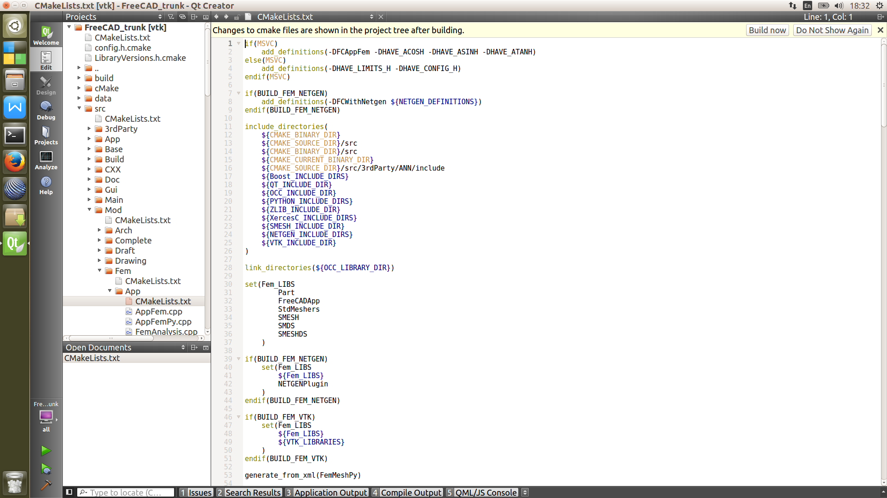
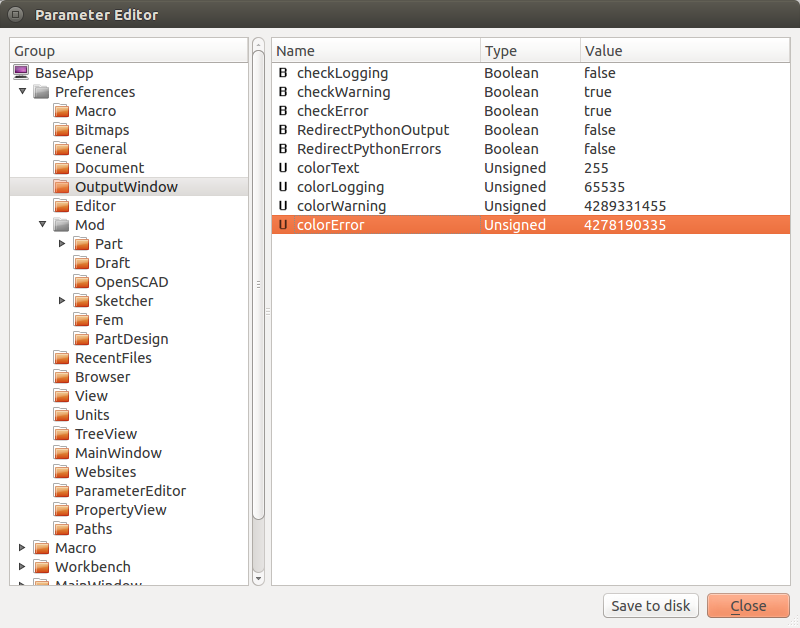

# Testing and Debugging Module


### Python and c++ IDE

For python coding, a text editor with grammer highlight + QtDesigner is enough to code in the first case. QtDesigner can be used to generate and edit Qt ui files. Spyder, which comes with Anaconda, is a good and lightweight Python IDE with debugger support.
 
Various c++ IDE are available to support Cmake project. Visual Studio 2015 is essential for developement on Windows. Cmake project can be mapped to a VS solution (*.sln) with a bundle of projects corresponding to 

Latest QtCreator works with Qt 4.x and Qt 5.x; it also support CMake project. 

see tutorial of import cmakelists.txt as project file <http://doc.qt.io/qtcreator/creator-project-cmake.html>

1.    Select File > Open File or Project.
2.    Select the CMakeLists.txt file from your CMake project.
3.    Select out of source build folder, you may have already
4.    Run camke once to build up pcb database
5.    The whole FreeCAD source tree will be loaded into QtCreator
6.    Further configuration 'Projects > Build Settings > Edit build configuration'



QtCreator or similar IDE can provide:

- graphic git support
- code completion and API hint
- fast code nagivation by 'goto definition'
- break point setup in debug
- CMakeLists.txt editor with grammer highlight and keyword completion, etc.

## Extra tools for module developer

- InkScape to generate SVG icon
Great vector drawing programm. Adhers to the SVG standard and is used to draw Icons and Pictures. Get it at <http://www.inkscape.org>

- Doxygen to generate doc
A very good and stable tool to generate source documentation from the .h and .cpp files.

- Gimp to edit XPM icon file
Not much to say about the Gnu Image Manipulation Program. Besides it can handle .xpm files which is a very convenient way to handle Icons in QT Programms. XPM is basicly C-Code which can be compiled into a programme. Get the GIMP here: <http://www.gimp.org>

- ccache to reduce building time

- cppcheck to improve coding quality


*****************************************************

## C++ debugging

### build FreeCAD from source 

First of all, make sure you can build the official source once done `git clone` which confirms you can install all the lib dependent.

compiler's warning is the first place to spot error and potential bugs.

### reduce compiling time by ccache

#### Incremental compilation by ccache

#### update *.ui file 

#### compile only one module

```
after changing an ui-file like this one (https://github.com/FreeCAD/FreeCAD/blob ... ces-ifc.ui) I have to run make clean && make to get the changes active.

Re: make clean after changing an *.ui file    Postby wmayer » Thu Aug 06, 2015 4:46 pm

In this case cd into the Arch directory first before running "make clean" because then it only rebuilds this module and not the whole project.
```

### print debug info
Qt debug <http://doc.qt.io/qt-4.8/debug.html>

The console class This class manage all the stdio stuff.  here is the generated document for [src/Base/Console.h]

> This includes Messages, Warnings, Log entries and Errors. The incomming Messages are distributed with the FCConsoleObserver. The FCConsole class itself makes no IO, it's more like a manager. ConsoleSingleton is a singleton! That means you can access the only instance of the class from every where in c++ by simply using:
```
  #include <Base/Console.h>
  //...
  Base::Console().Log("Stage: %d",i);
```

[src/Base/Tools.h]
```
struct BaseExport Tools
{
    /**
     * @brief toStdString Convert a QString into a UTF-8 encoded std::string.
     * @param s String to convert.
     * @return A std::string encoded as UTF-8.
     */
    static inline std::string toStdString(const QString& s) 
        { QByteArray tmp = s.toUtf8(); return std::string(tmp.constData(), tmp.size()); }

    /**
     * @brief fromStdString Convert a std::string encoded as UTF-8 into a QString.
     * @param s std::string, expected to be UTF-8 encoded.
     * @return String represented as a QString.
     */
    static inline QString fromStdString(const std::string & s) 
        { return QString::fromUtf8(s.c_str(), s.size()); }
}
```

example usage of QString from *std::string*, `#include <Base/Tools.h>`
`Base::Tools::fromStdString()`

### tips for debug cpp code

- compile only the module `/opt/FreeCAD/build/src/Mod/Fem$ make`

- show logging info: 

Edit -> Preference ->output windows -> record log


## step-by-step debugging via gdb

Once I run into *Segmentation fault (core dumped)* for "import vtk" in python console of FreeCAD and FreeCADCmd.
GDB might tell you more information, like which function, file object cause this fault.

<https://sourceware.org/gdb/onlinedocs/gdb/Continuing-and-Stepping.html>

step-by-step debugging
```
gdb freecadcmd
gdb start
gdb continue
gdb where
```


**********************************************************
## Python debugging

### tips for developing in Python

- remember : modified python file will not take effect until FreeCAD is relauched 

- always try to write a test function avoiding test in GUI mode

	Debugging functionality without GUI could be straightforwards, e.g. 
	[src/Mod/Fem/TestFem.py], 

For Gui funtions, recarding all operation into Macro, and replay them can accelerate the testing. 

- symbolic link to python files for quick test without installation after compiling for the mixed c++ and python coding

```bash
ln -s /opt/Cfd/FoamCaseBuilder  fc_build_dir/Mod/Cfd/FoamCaseBuilder
```

### Where is python's print message?

`print "Error Message"` does not work in FreeCAD, neither PythonConsole in GUI mode, or terminal starting freecad program (stdout can be viewed in ReportView, by activating this view). By changing the default preference, it is possible to show print message from python module.



- Method 1: FreeCAD.Console.PrintMessage() for show up
- Method 2: Print to TextEdit widget in your specific TaskPanel  class


[src/Gui/GuiConsole.h]
```
/** The console window class  This class opens a console window when instanciated  and redirect the stdio streams to it as long it exists. 
 *  After instanciation it automaticly register itself at   the FCConsole class and gets all the FCConsoleObserver  massages. The class must not used directly! Only the  over the FCConsole class is allowed!
 */
```

### reload edited python module


[Discussion on reload python code without restart FreeCAD](http://forum.freecadweb.org/viewtopic.php?f=10&t=12666)

```
>>> import FemTools
>>> FemTools.FemTools.known_analysis_types
['static', 'frequency']
---- Here I added one more analysis type to known_analysis_type in FemTools.py file ----- 
>>> reload(FemTools)
<module 'FemTools' from '/home/przemo/software/FreeCAD/build/Mod/Fem/FemTools.py'>
>>> FemTools.FemTools.known_analysis_types
['static', 'frequency', 'mock']
```

