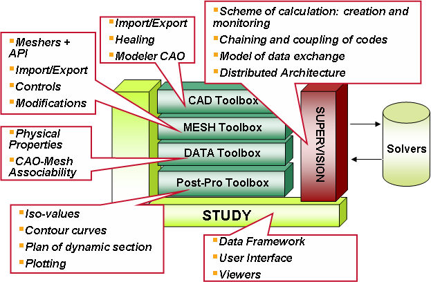

## Combining the strength of FreeCAD and Salome

**FreeCAD** is a superior (under development) 2D and 3D CAD software, it is clear.  

**Salome** is a powerful platform to glue many FOSS CAE software together, see <http://www.salome-platform.org/>  
Salome has plugin architecture, using Qt, Python, and has a similar architecture with FreeCAD.

[Documentation on integrating components to Salome](http://docs.salome-platform.org/latest/gui/YACS/components.html)

Even though it's listed on the Salome website as a feature:  
- [x] Supports interoperability between CAD modeling and computation software (CAD-CAE link).

**In reality** the CAD-CAE link, at least in regards to FreeCAD, is missing.

Some example of opensource CAE Solvers:
- **Elmer** (FEM+multiphysics),
- **Code_Aster** (FEM+multiphysics),
- **OpenFOAM** (FEM+CFD),
- **Code_Saturne** (CFD)
- **bluefish** for Boltzman method
- more if you search

Pre-processing and post-processing tools: Salome-Mesh/gmsh, ParaView

The processing of FreeCAD modeling -> Salome Meshing -> OpenFome Solver -> Paraview visualization seems very promising, and there has been an example:  
[Tutorial for FreeCAD + Salome+OpenFoam cavity driving flow case](http://uberlinux.blogspot.co.uk/2015/01/tutorial-1lid-driven-cavity-in-openfoam.html)

[Salome Documentation](http://docs.salome-platform.org/latest)

### A Commercial CAD and CAE Solution

**SolidWorks** supports name attribute on solids in STEP import/export: in other words, you can define the name of solids/faces/edges/vertices in the GUI and this name is linked when exporting the part in STEP format.

**Ansys** workbench "Not only do we import geometric entities such as bodies, faces, or edges, but we also support the import of such additional attributes as: materials, selections of entities, and design parameters", see more at [Leveraging Parametric CAD Models with ANSYS Bidirectional Interfaces ](http://www.ansys.com/Products/Simulation+Technology/Structural+Analysis/Structural+Technology+Leadership/Technology+Tips/Leveraging+Parametric+CAD+Models+with+ANSYS+Bidirectional+Interfaces)

**Ansys** workbench starts an external CAD software, an "Ansys Link" menu appears in the CAD software.  After finishing modeling in the CAD software (triggered by closing/jumping back to Ansys workbench) the geometry and named entities are ready to use. I believe IGES/STEP is used to transfer model.

### A Possible Solutions for an Open Source Stack
FreeCAD could be embedded into Salome as "Paraview", since they are all based on Qt. While it is out of my scope of knowledge,  Embedded python

[Example of Embedding a FreeCAD Python Module into Blender](https://www.freecadweb.org/wiki/Embedding_FreeCAD)

Even if, a 'contract' still needed to be defined for at least single direction information transfer (CAD model + `namedSelection`) to meshing tools, the meshing tool will never modify topology, e.g. beam thickness change in CAD model will not invalidate meshing rules and CAE solver setup, just updating internal cell position by meshing tool.

CAD named selection (**Salome**: *Group*; **AnsysWorkbench** *namedSelection*), contacting interface between bodies, material information exported could be useful to coordinate different CAE solver.

Post-processing is more independent, a Paraview macro (setup in GUI) should reply reach time after geometrical change.

Note More CFD open source tools can be found at [cfdonline](http://www.cfd-online.com/Links/soft.html)

### Exporting Model and Extra Information

If embed attribute into STEP is hard, a bundle of XML + STEP could be used. See FreeCAD forum discussion of [Managing shapes names with STEP import/export](https://forum.freecadweb.org/viewtopic.php?t=3972)

A simple solution will be: Salome requests a geometry be modeled and saved with pre-determined file name and folder location. It signals the finished event (instead of closing the CAD software which is time consuming to spin up again). If no good and portable IPC is available, the `FileSystemWatcher` polling by Salome (caller) would be enough.

Boundarycondition setup,  
NamedSelection  
Material  

### IPC

Interprocess communication with other CAE software, file exchange is the first (COM, DBus, no portable way)

In **FreeCAD**: *subprocess.PIPE* is used to communicate with external process, by catch up the stdin and stdout, as well as the returncode at the process exit.

In **Salome** a higher level infrastructure is used.

https://github.com/mikeboers/PyAV/blob/master/examples/audio.py

`Application.h` key for embedding, same Qt version, derived from `App::Application`

http://docs.enthought.com/mayavi/mayavi/auto/example_qt_embedding.html
